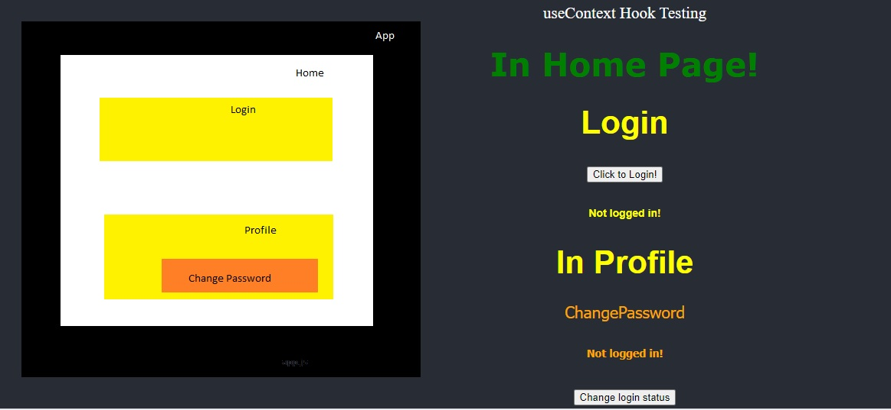

#### Topics

* Global State & Context API
* Lifting up the State
* Prop drilling
* Creating the Context
* useContext hook

#### useContext Hook
Ref 1 [https://www.youtube.com/watch?v=lnL6gRkQ5g8]

Helps create global state that is accessible from all the siblings

